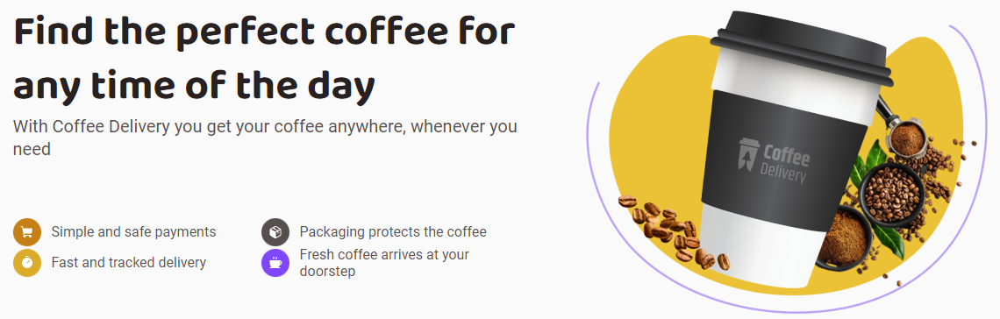
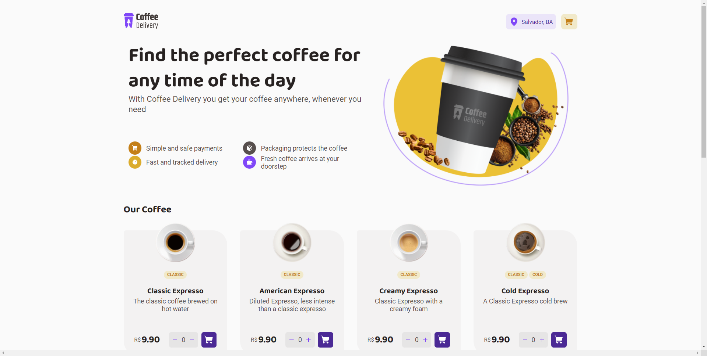
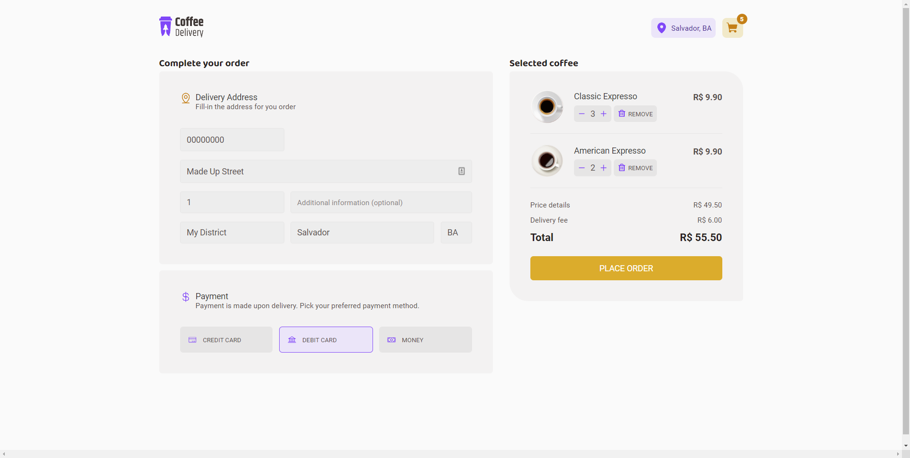
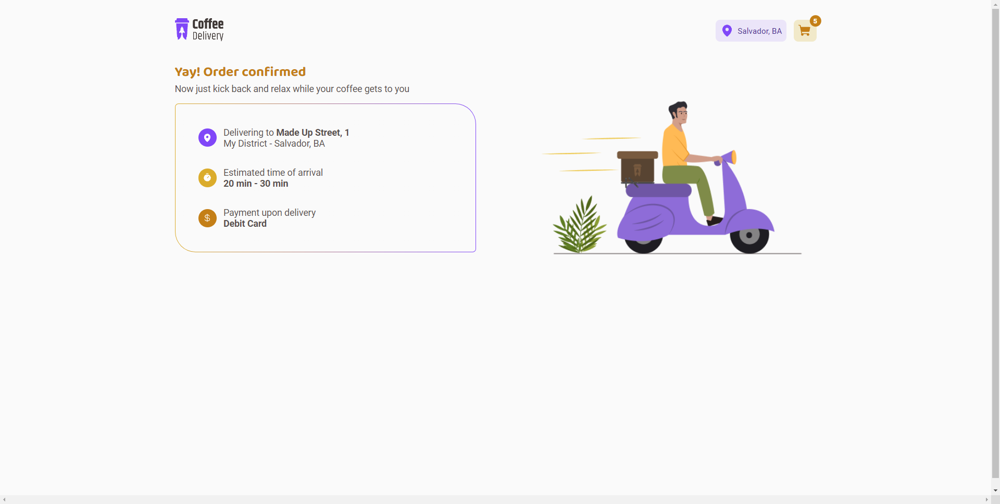
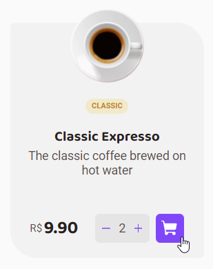
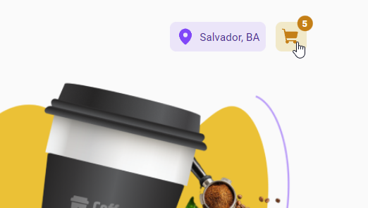
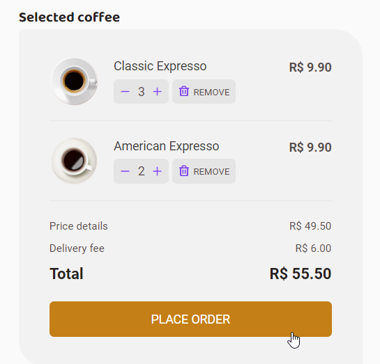

# Coffee Delivery
Coffee Delivery simplified. Just pick your coffee and have it at your door within instants.

## Status
🚧 Under development 🚧

## About us
Coffee Delivery is a solution for people who want their coffee, wherever and whenever they want, in a very simple fashion. Just pick your coffee and it'll get to you quick, fresh and hot (or cold, you do you). Simple as that.

## Content table
<!--ts-->
   * [About us](#About-us)
   * [Installing](#Installing)
   * [Samples images](#Sample-images)
   * [How to use](#How-to-use)
   * [Technologies](#Technologies)
<!--te-->

## Installing

### Requisitos:
  * Nodejs

To install you only need to clone the repository and extract it. Now on your terminal:
* cd coffee-delivery
* npm install
* npm run dev

## Sample images
<h1>
  
    &nbsp;
  
   &nbsp;
  
</h1>

## How to use

Using this application is very simple. You just have to pick from this wide variety of coffees using the inscrease/decrease quantity buttons and then add them to the cart by clicking the purple Cart button.

<h1 align="center">
  
</h1>

Once you're done, you can then click the shopping cart icon a the top-right to go into your cart where you can fill in the delivery information and review your order. Once you're ready, you can just sumbit by click the place order button.

<h1 align="center">
  
  
</h1>

## Technologies

- [Vite](https://vitejs.dev/)
- [React](https://reactjs.org/)
- [TypeScript](https://www.typescriptlang.org/)
- [styled-components](https://styled-components.com/)
- [React Router DOM](https://www.npmjs.com/package/react-router-dom)
- [Phosphor Icons](https://phosphoricons.com/)
- [React Hook Form](https://react-hook-form.com/)
- [Radix](https://www.radix-ui.com/) - Toggle Group
